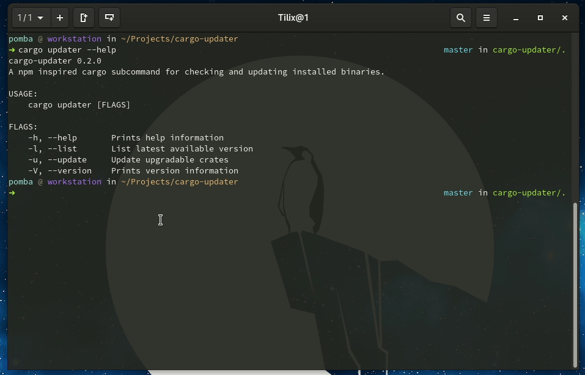

# Cargo global

> A npm inspired cargo subcommand for checking and updating executables installed.

### Screenshot

[](./screencast.gif)

### Installation

Currently this is available only through `git`, will publish to `crates.io` once i settle with a name.

```
cargo install --git https://github.com/pjmp/cargo-global.git
```
