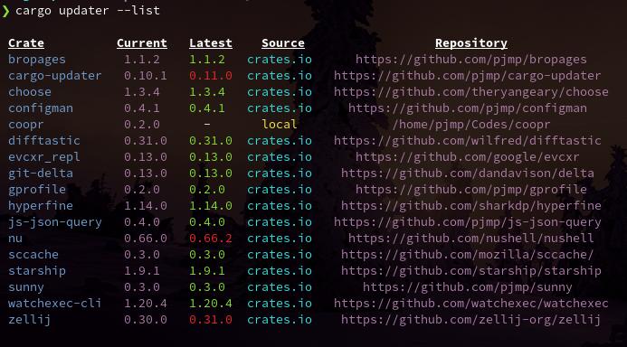

# Cargo updater

> A npm inspired cargo subcommand for listing and updating binaries installed in $CARGO_HOME/bin.


[](https://crates.io/crates/cargo-updater)


### Demo

[](./demos/demo.gif)

## Features

> List installed, view available updates

[](./demos/list.png)

> Install all upgradeable binaries

[](./demos/final.png)


### Installation

```shell script
cargo install cargo-updater
```

### Usage

```shell script
cargo updater
```

### Similar projects

| Crate | Dependencies | Simple | Pretty <!-- beauty lies in the eyes of the beholder --> |
| - | - | - | - |
| [cargo-update](https://crates.io/crates/cargo-update) | 22 | ❌ | ❌ |
| [cargo-upgrades](https://crates.io/crates/cargo-upgrades) | 5 | ✅ | ❌ |
